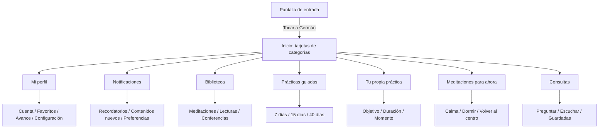

# Asistente Germán — mapa del proyecto

Este directorio es el proyecto local real de la PWA. La conversación de Codex sirve para trabajar sobre él, pero el código y los recursos permanecen guardados en esta carpeta.

## Flujo principal

## Comportamiento común

- Cada pantalla tiene un encabezado fijo.
- Cada pantalla tiene un botón Volver visible.
- Se muestran dos tarjetas a la vez.
- Al desplazar, la tarjeta inferior sube y se monta sobre la superior.
- La última tarjeta queda abajo y no se monta.
- Al tocar una tarjeta se abre su menú interno con la misma interfaz.
- No se muestran estadísticas, fechas, audios ni cantidades ficticias.

## Archivos principales

- `app/page.tsx`: mapa de pantallas, tarjetas, menús y navegación.
- `app/content.generated.json`: contenido real de los tres planes de 7 días y las 15 meditaciones por momento.
- `app/category-deck.css`: interfaz de dos tarjetas, montaje, encabezados y botón Volver.
- `app/german-entry.css`: entrada con la imagen de Germán.
- `public/german-welcome.png`: imagen principal.
- `public/sw.js`: recepción de notificaciones push y apertura directa de la aplicación.
- `scripts/generate-content.mjs`: transforma el documento maestro en datos utilizables por la aplicación.
- `out/`: versión estática generada para probar desde la Mac o el teléfono.

## Contenido conectado

- Amor y relaciones: 7 días, 28 prácticas y 84 frases.
- Dinero y trabajo: 7 días, 28 prácticas y 84 frases.
- Salud y bienestar: 7 días, 28 prácticas y 84 frases.
- Meditaciones para ahora: 15 prácticas completas.
- Notificaciones: permiso del navegador, horarios locales y service worker preparados.

Los planes de 15 días, el contenido completo del taller de 40 días, las conferencias y parte de los audios todavía deben conectarse cuando estén disponibles en el proyecto.
